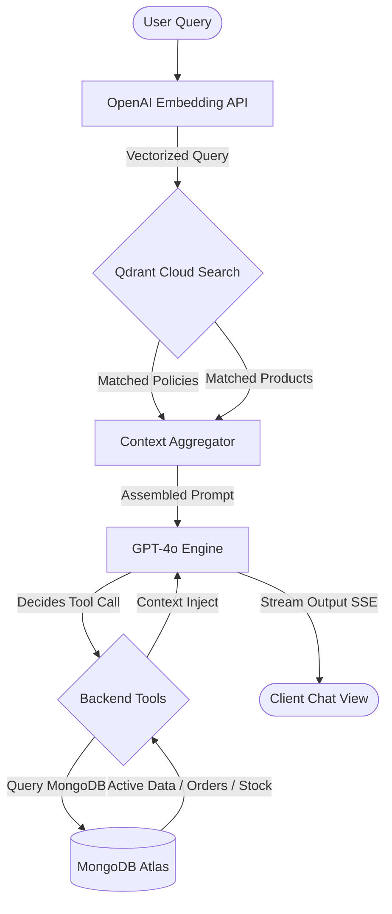

# NovaWear AI Customer Support Engine - Project Summary

This document provides a concise overview of the architecture, data flow, technology stack, and features of the **NovaWear AI Customer Support Assistant** application.

---

## ⚙️ Project Tech Stack

* **Frontend**: React (Vite), React Router, Axios, Lucide Icons, Vanilla CSS (Modern minimalist Light Theme).
* **Backend API**: Node.js, Express.js, JWT (JSON Web Tokens) Auth, Multer (file uploads), Express-Rate-Limit.
* **Databases**:
  * **Primary DB**: MongoDB Atlas Cloud (structured storage for Users, Products, Inventories, Orders, Reviews).
  * **Vector DB**: Qdrant Cloud (semantic search vector collections for product descriptions and company manuals).

---

## 🤖 AI Models Used

1. **Reasoning & Tool Execution**: `gpt-4o` (OpenAI)
   * Handles natural language understanding, conversational styling, context analysis, and dynamic database tool execution.
2. **Text Vectorization**: `text-embedding-3-small` (OpenAI - 1536 dimensions)
   * Vectorizes policy documents, product tags, and user chat queries for semantic similarity matching.

---

## 🔄 Core RAG & Tool Flow

The diagram below represents how the system processes a user's question:

1. **User Query**: User sends a request (e.g., *"Show me hoodies under $80"*).
2. **Semantic Retrieval (RAG)**: The backend converts the query to a vector and searches **Qdrant Cloud** to find relevant company knowledge documents and semantic product matches.
3. **Reasoning Prompt**: The matched contexts are loaded into the GPT-4o prompt alongside the customer's size and style preferences.
4. **Tool Execution (Optional)**: If the user asks for dynamic database details (e.g., order shipment status, exact inventory stock levels), GPT-4o invokes database tools (`trackOrder`, `recommendProducts`) to pull data from **MongoDB Atlas**.
5. **Streaming Response**: The final styled Markdown response is streamed back to the frontend bubble via **Server-Sent Events (SSE)**.

---

## 🌟 Key Features

* **Grounded Policy Q&A (RAG)**: Connects company manuals (PDF, DOCX, TXT, MD) to the chat, answering shipping, return, and care queries accurately.
* **Semantic Product recommendations**: Recommends products based on style and context (e.g., *"breathable summer wear"*) instead of simple database string matches.
* **Interactive Tool Console**: Integrates order tracking, stock checks, and catalog filters dynamically during conversation.
* **Stop Generation**: Allows clients to instantly halt incoming AI stream tokens.
* **Admin Dashboard Control**: Enables administrators to upload/delete policy manuals, re-index vector collections, and inspect live inventory logs.
* **JWT Security & Rate Limiting**: Protects admin endpoints with cryptographically signed tokens, prevents user identity spoofing, and restricts API abuse via IP rate limits.
